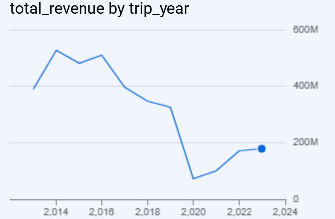
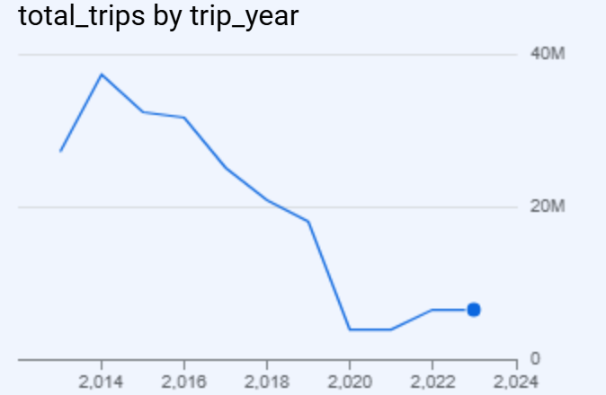
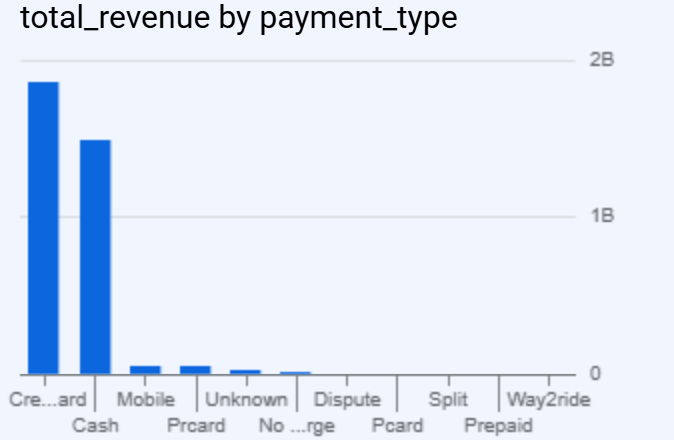
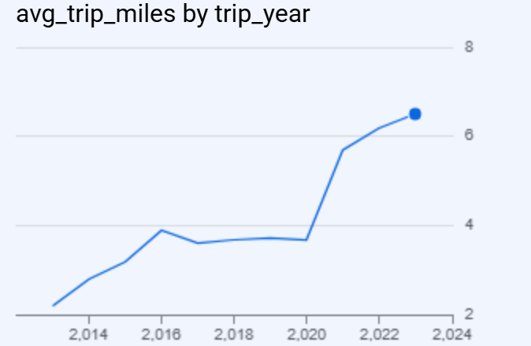

# Chicago Taxi Trips Analysis | BigQuery + Tableau Portfolio Project

An end-to-end data analytics project using **Google BigQuery** and **Tableau Public** to analyze over **213 million Chicago taxi trips**.
The project workflow included querying raw data in Google BigQuery, preparing aggregated datasets with SQL, and building an interactive dashboard in Tableau Public.
---

## Dashboard Preview


---

## Project Overview

This project explores the Chicago Taxi Trips public dataset using SQL in Google BigQuery and visualizes key business insights in Tableau.


## Business Questions

This project aims to answer the following business questions:

1.What are the overall key performance indicators (KPIs) for Chicago taxi trips?  
2.How has taxi revenue changed over the years?  
3.How has annual trip volume changed over time?  
4.Which payment methods generate the highest revenue?  
5.How has the average trip distance changed over time?  

## Dataset

- Source: Google BigQuery Public Dataset
- Dataset: `bigquery-public-data.chicago_taxi_trips.taxi_trips`
- Records analyzed: 213.1 million taxi trips

---


## SQL Techniques Used

During this project I used SQL to perform:

- Aggregate Functions (COUNT, SUM, AVG)
- Date Functions (EXTRACT)
- Filtering (WHERE)
- Grouping and Aggregation (GROUP BY)
- Sorting Results (ORDER BY)
- KPI Calculations

  ## BigQuery Visualizations

The SQL queries were first executed and validated in **Google BigQuery**. Before creating the Tableau dashboard, I used BigQuery's built-in visualization tools to verify trends and explore the data.

### Revenue by Year


### Trip Volume by Year


### Revenue by Payment Type


### Average Trip Distance


## Query Results

Screenshots of the SQL queries executed in Google BigQuery are available in the `images/query_results` folder.

## Tools Used

- Google BigQuery
- Standard SQL
- Tableau Public
- GitHub

---

## Tableau Dashboard

The dashboard was built in Tableau Public using the SQL outputs generated in Google BigQuery.

### Dashboard Features

- KPI cards
- Annual Revenue Trend
- Annual Trip Volume
- Revenue by Payment Type
- Average Trip Distance Trend

**Interactive Dashboard**

(https://public.tableau.com/views/ChicagoTaxiTripsAnalysisDashboard/Dashboard1?:language=en-US&:sid=&:redirect=auth&:display_count=n&:origin=viz_share_link)

## Key Insights

- More than **213 million** taxi trips were analyzed.
- Total revenue exceeded **$3.5 billion**.
- Credit Card and Cash were the dominant payment methods.
- Taxi trips dropped significantly during 2020.
- Average trip distance increased after 2020.


## Repository Structure

```text
Chicago-Taxi-Analysis
│
├── sql/
│   ├── 01_total_kpi.sql
│   ├── 02_revenue_by_year.sql
│   ├── 03_trip_volume_by_year.sql
│   ├── 04_revenue_by_payment_type.sql
│   └── 05_average_trip_distance.sql
│
├── images/
│   ├── query_results/
│   │   ├── 01_kpi_summary.png
│   │   ├── 02_revenue_by_year.png
│   │   ├── 03_trip_volume_by_year.png
│   │   ├── 04_revenue_by_payment_type.png
│   │   └── 05_average_trip_distance.png
│   │
│   └── charts/
│       ├── 02_revenue_by_year_chart.png
│       ├── 03_trip_volume_by_year_chart.png
│       ├── 04_revenue_by_payment_type_chart.png
│       └── 05_average_trip_distance_chart.png
│
├── dashboard/
│   ├── dashboard_notes.md
│   └── tableau_public_link.md
│
├── documentation/
│   └── project_notes.md
│
├── data/
│   └── README.md
│
└── README.md
```

## Skills Demonstrated

SQL
Google BigQuery
Tableau Public
Data Visualization
Business Analysis
Data Aggregation
KPI Reporting
Data Cleaning
GitHub Documentation

---

## Author

**Nima Esfandiari**

Data Analyst | SQL | Tableau | Excel | BigQuery

Feel free to connect with me on LinkedIn and explore my other projects.
